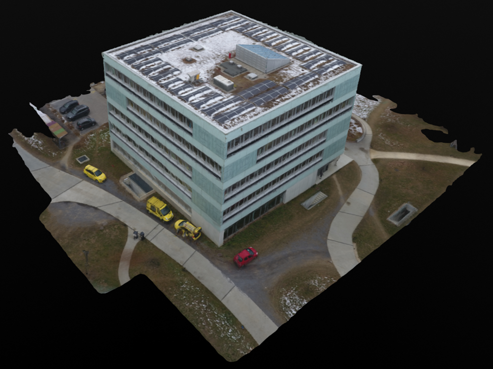

# DUSt3R — 3D model z fotografií (Google Colab)

Jednoduché demo, které ukazuje, jak lze z běžných fotografií vytvořit 3D model pomocí AI modelu **DUSt3R**.

---


Vytvoříme z několika snímků stejné scény 3D model:

* odhadne hloubku
* najde vztahy mezi obrázky
* zrekonstruuje prostor
* vytvoří 3D scénu (point cloud / mesh)

---

## Co získáme

* interaktivní 3D model vytvořený z fotek
* vizualizaci prostoru bez použití LiDARu nebo 3D skeneru
  
---

## Proč Google Colab?

* není potřeba vlastní GPU
* běží v cloudu
* rychlé spuštění během několika minut

---

## Postup

### 1 . Stažení projektu

```bash
!git clone --recursive https://github.com/naver/dust3r
```

stáhne celý projekt DUSt3R z GitHubu včetně všech závislostí (submodulů).

---

### 2. Instalace knihoven

```bash
!pip install -r /content/dust3r/requirements.txt
```

nainstaluje všechny potřebné Python balíčky pro spuštění modelu.

---

### 3. Spuštění demo aplikace

```bash
!python3 /content/dust3r/demo.py --model_name DUSt3R_ViTLarge_BaseDecoder_512_dpt
```

spustí webové rozhraní (Gradio), kde nahraješ obrázky a vytvoříš 3D model.

---

## !!! Důležitá úprava !!! 

Aby bylo možné otevřít demo v prohlížeči, je potřeba upravit:

```python
demo.launch(share=False)
```

na:

```python
demo.launch(share=True)
```

Tímto se vytvoří veřejný odkaz 

---

## Jak funguje rekonstrukce v UI

1. nahraješ fotografie
2. model najde společné body
3. odhadne hloubku
4. vypočítá pozice kamer
5. složí scénu do 3D prostoru

---




## Zdroj

https://github.com/naver/dust3r
